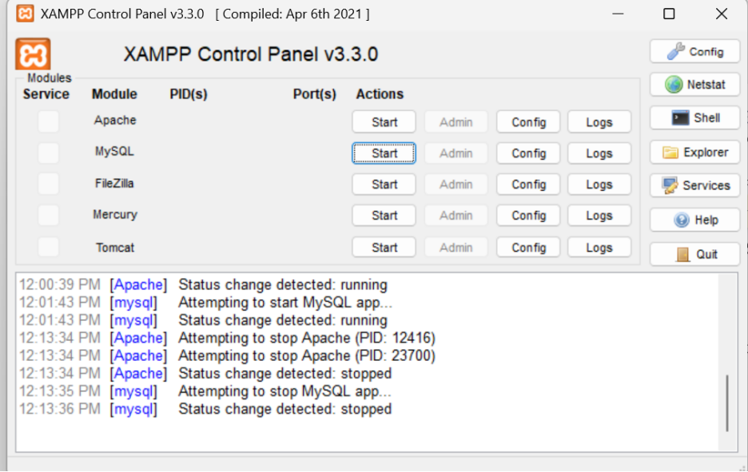

# Week 1: Local Development Environment Setup

## Objective
Set up a local server environment (XAMPP/WAMP/Laragon) and verify Apache, MySQL, and PHP are working correctly.

---

## Evidence

### Fig 1: Installation of XAMPP

### Fig 2: Apache and MySQL Running

### Fig 3: Localhost Test Page

### Fig 4: Hello World Test

### Fig 5: Database Connection Test

---

## Summary
Local environment configured successfully. Apache and MySQL services confirmed running, localhost accessible via browser, and database connection verified.